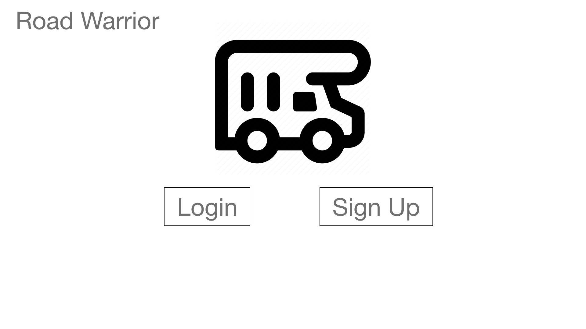
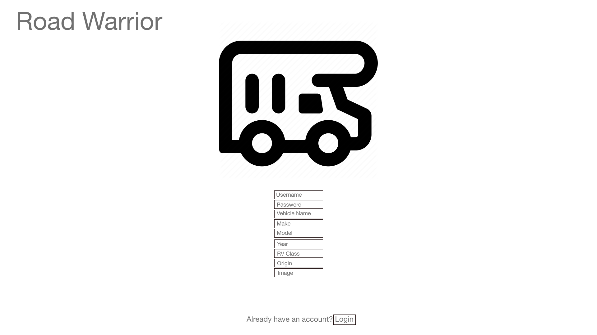
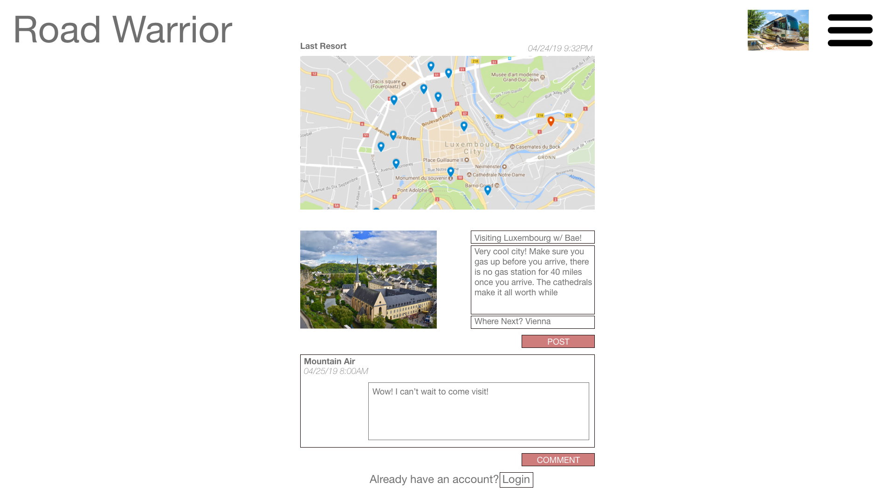

# Road-Warrior
**PROJECT DESCRIPTION**

Road Warrior is a full stack web application for sharing your recreational vehicle journey with fellow RV enthusiasts! With this app an RV driver can make a profile and post about their trip with their current location information, where they are coming from, where they are going and tips and tricks along the way.

**Below is a link to the app itself**

**Below is a link to the Trello Board**

https://trello.com/b/3B3RgqMa/road-warrior

**Below is a link to the wireframe images**

**Below is a list of technologies/libraries/frameworks/dependencies and resources... think of this section as a citation of sources**

Adobe XD, PostgresQL, Python, Django, React.js, styled-components, Bootstrap, axios, react-router-dom, npm, nodemon, Heroku, Github, react-google-maps-api, W3Schools, https://scotch.io/tutorials/build-a-to-do-application-using-django-and-react#toc-prerequisites, and classroom lessons.

**Below is a list of goals for version 2**

- version 2 goal: 
- version 2 goal: 
- version 2 goal: 

**Special Thanks**

- JB Watson
- William Njie
- Daniel Mishael
- Andrew McIntosh
- Shomari Pope
- Destin Floyd
- Atarius Armstrong
- Noah Harvey

for inspiration, motivation, and guidance along the way!